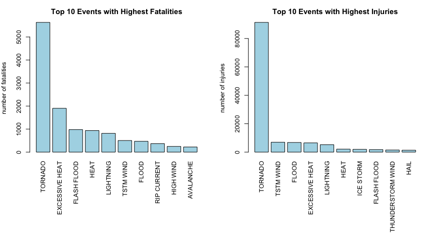
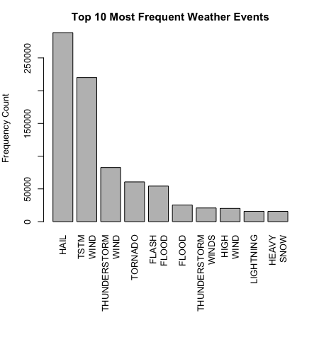

# NOAA Storm Data Analysis Report

------

## Synopsis

Storms and other severe weather events can cause both public health and economic problems for communities and municipalities. Many severe events can result in fatalities, injuries, and property damage, and preventing such outcomes to the extent possible is a key concern.  

This project explores the U.S. National Oceanic and Atmospheric Administration's (NOAA) storm database. This database tracks characteristics of major storms and weather events in the United States, including when and where they occur, as well as estimates of any fatalities, injuries, and property damage.  

The basic goal of this project is to investigate:  

1. Which types of events are most harmful with respect to population health, and  
2. Which types of events have the greatest economic consequences.  

The analysis will be supported by tables, figures, and other R packages and functions.  

------

## Data

The data for this assignment come in the form of a comma-separated-value file compressed via the bzip2 algorithm to reduce its size. You can download the file from the course web site:  

- [Storm Data](https://d396qusza40orc.cloudfront.net/repdata%2Fdata%2FStormData.csv.bz2) [47Mb]

There is also some documentation of the database available. Here you will find how some of the variables are constructed/defined.  

- National Weather Service [Storm Data Documentation](https://d396qusza40orc.cloudfront.net/repdata%2Fpeer2_doc%2Fpd01016005curr.pdf)  
- National Climatic Data Center Storm Events [FAQ](https://d396qusza40orc.cloudfront.net/repdata%2Fpeer2_doc%2FNCDC%20Storm%20Events-FAQ%20Page.pdf)  

The events in the database start in the year 1950 and end in November 2011. In the earlier years of the database there are generally fewer events recorded, most likely due to a lack of good records. More recent years should be considered more complete.  

------

## Data Processing

### Reading the file

Firstly, we start from reading the file and saving it as a data frame for further processing with R.  

```{r}
# Read the csv file and save it in raw_data. (This may take some time.)
raw_data <- read.csv("./repdata_data_StormData.csv.bz2")
```

### Summary of Data

```{r}
# Take a look at raw_data,
head(raw_data)

# Number of samples collected:
nrow(raw_data)

# Variables measured:
names(raw_data)

# Number of different weather event types:
length(table(raw_data$EVTYPE))
```

### Extracting relevant variables

In this project, we are interested in the consequences of the different types of events (EVTYPE) with respect to population health (FATALITIES,INJURIES) and the economy (PROPDMG, PROPDMGEXP, CROPDMG, CROPDMGEXP).

```{r}
# Impact on population health
# Aggregate the data by event type
fatality <- aggregate(FATALITIES ~ EVTYPE, raw_data, sum)
injury <- aggregate(INJURIES ~ EVTYPE, raw_data, sum)


# Impact on the economy
economy <- raw_data[, c("EVTYPE", "PROPDMG", "PROPDMGEXP", "CROPDMG", "CROPDMGEXP")]

# Explore the property damage exponent
unique(raw_data$PROPDMGEXP)
# Convert the property damage exponent and calculate the property damage value
economy$PROPEXP <- c(1000,1e+06,1,1e+09,1e+06,1,1,1e+05,1e+06,1,10000,100,1000,100,1e+07,1,1,1,1e+08)[match(economy$PROPDMGEXP,as.character(unique(raw_data$PROPDMGEXP)))]
economy$PROPDMGVAL <- economy$PROPDMG*economy$PROPEXP

# Explore the property damage exponent
unique(raw_data$CROPDMGEXP)
# Converting the crop damage exponent
economy$CROPEXP<- c(1,1e+06,1000,1e+06,1e+09,1,1,1000,100)[match(economy$CROPDMGEXP,as.character(unique(raw_data$CROPDMGEXP)))]
economy$CROPDMGVAL <- economy$CROPDMG*economy$CROPEXP

# Aggregate the data by event type
property <- aggregate(PROPDMGVAL ~ EVTYPE, economy, sum)
crop <- aggregate(CROPDMGVAL ~ EVTYPE, economy, sum)
```

------

## Results

### Impact on population health

```{r}
# Extract the top 10 event with highest fatalities
fatality10 <- fatality[order(-fatality$FATALITIES), ][1:10, ]
# Extract the top 10 event with highest injuries
injury10 <- injury[order(-injury$INJURIES), ][1:10, ]
# Plot the data
par(mfrow = c(1, 2), mar = c(12, 4, 3, 2), mgp = c(3, 1, 0), cex = 0.8)

barplot(fatality10$FATALITIES, las = 3, names.arg = fatality10$EVTYPE, main = "Top 10 Events with Highest Fatalities", ylab = "number of fatalities", col = "lightblue")

barplot(injury10$INJURIES, las = 3, names.arg = injury10$EVTYPE, main = "Top 10 Events with Highest Injuries", ylab = "number of injuries", col = "lightblue")
```


From the figures, it is evident that *tornado* and *excessive heat* are the weather events with the top 2 greatest fatalities, where the fatility due to *tornado* of 5633 is significantly higher than the others. Similarly, *tornado*, with 91346 injuries, is significantly more disastrous than the others.

Therefore, among the 985 weather types, **tornado** has the most severe impact on population health in the United States.

### Impact on the economy

```{r}
# Extract the top 10 event with highest property damage
property10 <- property[order(-property$PROPDMGVAL), ][1:10, ]


# Extract the top 10 events with highest crop damage
crop10 <- crop[order(-crop$CROPDMGVAL), ][1:10, ]

par(mfrow = c(1, 2), mar = c(12, 4, 3, 2), mgp = c(3, 1, 0), cex = 0.8)

barplot(property10$PROPDMGVAL/(10^9), las = 3, names.arg = property10$EVTYPE, main = "Top 10 Events with Greatest Property Damages", ylab = "Cost of damage ($ billions)", col = "moccasin")

barplot(crop10$CROPDMGVAL/(10^9), las = 3, names.arg = crop10$EVTYPE, main = "Top 10 Events With Greatest Crop Damages", ylab = "Cost of damage ($ billions)", col = "moccasin")
```


From the figures, it is evident that *flood*, *hurricane/typhoon* and *tornado* are the weather events with the top 3 greatest property damage, where the cost of damage by *flood* of \$144.66 billion is significantly higher than the others. Similarly, *drought*, *flood*, *river flood* and *ice flood* are the weather events with the top 4 greatest crop damage, where the cost of damage by *drought* of about \$13.97 billion is significantly higher than the others.

Therefore, among the 985 weather types, **flood** has the most severe economic consequence in the United States.


### Critical Analysis

```{r}
# Plotting the frequency of the events
freq10 <- sort(table(raw_data$EVTYPE),decreasing = TRUE)[1:10]
nm <- c(names(freq10)) 
barplot(freq10, las = 3, names.arg = gsub(" ", "\n", nm), main = "Top 10 Most Frequent Weather Events", ylab = "Frequency Count", col = "gray", las = 3)
```


While *hail* and *TSTM (thunderstorm) wind* occur most frequently among all weather events, they do not incur severe health and economic consequences. Even though *tornado*, *flood* and *drought* do not occur frequently, their damages on average are still high.
